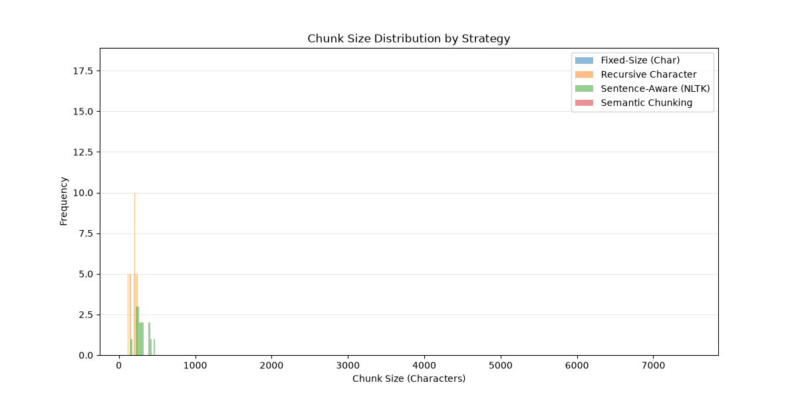

# Chunking Strategy Comparison Report

## Document

A synthetic, multi-topic document (~7,481 characters) built by repeating a passage covering three unrelated topics — RAG/chunking theory, Python for data science, and space exploration — five times. This mix of short paragraphs and distinct topic shifts makes it a good stress test for how each splitter handles both structure and meaning.

## Results

| Strategy | Total Chunks | Avg Size (chars) | Min Size | Max Size |
|---|---|---|---|---|
| Fixed-Size (Char) | 30 | 299.13 | 289 | 300 |
| Recursive Character | 40 | 186.38 | 118 | 242 |
| Sentence-Aware (NLTK) | 17 | 295.65 | 151 | 476 |
| Semantic Chunking | 1 | 7481.0 | 7481 | 7481 |

## Analysis by Strategy

**Fixed-Size (Character) Splitting** produces the most uniform chunks (289–300 chars) because it splits blindly at a fixed character count with no separator to respect. The cost is that it routinely cuts through the middle of words and sentences, which fragments meaning and hurts embedding quality — a chunk can end mid-thought and pick up an unrelated topic in the same vector.

**Recursive Character Splitting** produces the most chunks (40) and the smallest average size (186 chars) because it tries paragraph breaks first, then lines, then spaces, before falling back to raw characters. This keeps most cuts aligned to natural boundaries (paragraph/sentence ends), but the tight 300-char limit combined with this document's short paragraphs causes it to split some paragraphs further, producing more chunks than the sentence-aware method.

**Sentence-Aware (NLTK) Splitting** groups 3 sentences per chunk with 1-sentence overlap, guaranteeing every chunk ends on a complete sentence. This gives it the best semantic integrity of the non-embedding-based methods, at the cost of size consistency (151–476 chars) — chunks vary because sentence lengths vary, which is a reasonable trade-off for retrieval quality.

**Semantic Chunking** collapsed the entire document into a single 7,481-character chunk. This is a failure mode, not a strength: the `percentile` breakpoint threshold (default 95th percentile) is too conservative for this text. Because the document repeats the same three topics five times, consecutive-sentence embedding distances stayed below the threshold everywhere, so no breakpoint was ever triggered. In principle semantic chunking should be the best fit for a multi-topic document like this one — it's designed to detect exactly this kind of topic shift — but it needs a lower/tuned threshold (e.g. `breakpoint_threshold_type="standard_deviation"` or a lower percentile, such as 80–90) to actually fire on this data.

## Recommendation

**Recursive Character Text Splitting** is the best practical choice for this document type as configured.

- It respects natural text boundaries (paragraphs → lines → words) rather than cutting mid-sentence like fixed-size splitting.
- It keeps chunk sizes tightly bounded (118–242 chars), which is important for consistent embedding quality and predictable retrieval behavior — unlike sentence-aware chunking's wider 151–476 char spread.
- It requires no external model or threshold tuning, unlike semantic chunking, which is the theoretically ideal approach for a multi-topic document but failed out-of-the-box here and would need threshold tuning and validation before it could be trusted in production.

If semantic chunking's threshold is properly tuned (and validated against a non-repetitive, real-world document rather than this synthetic repeated sample), it would likely outperform recursive splitting for topic-shift-heavy content, since it is the only method here that reasons about meaning rather than surface structure. Until then, recursive character splitting offers the best balance of semantic coherence, size consistency, and reliability.
